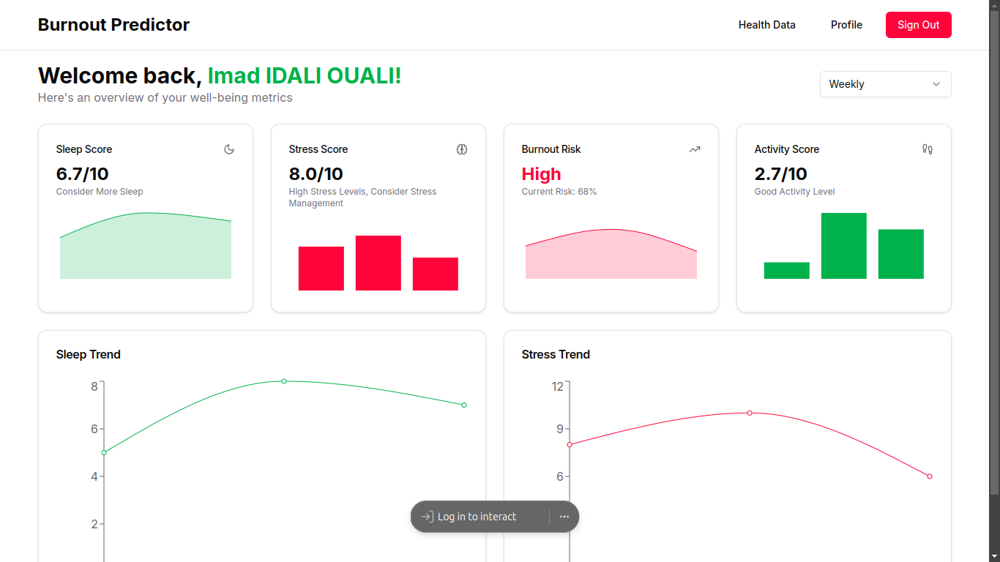

# Burnout Predictor

## Abstract

### Background and Problem Statement

In today's fast-paced work environment, burnout has become a significant issue affecting professionals across various industries. The lack of real-time, personalized tools to monitor and prevent burnout leaves many individuals vulnerable to its negative impacts on health, productivity, and overall well-being.

### Impact and Proposed Solution

Burnout Predictor aims to address this problem by leveraging smartwatch data and advanced AI algorithms to provide real-time burnout risk assessments and personalized recommendations. By empowering individuals with actionable insights, we can help prevent burnout before it occurs, leading to improved well-being, increased productivity, and better work-life balance.

### Project Outcomes and Deliverables

- A responsive web application for monitoring burnout risk
- Integration with popular smartwatch platforms
- AI-powered analysis of user data to provide personalized insights
- Real-time burnout risk assessments
- Trend analysis and visualization of user data over time
- Personalized recommendations for improving well-being and productivity



## Instructions

To run the Burnout Predictor project locally, follow these steps:

1. Clone the repository

2. Install dependencies:

   ```bash
   npm install
   ```

3. Set up environment variables:
   Create a `.env.local` file in the root directory and add necessary environment variables (e.g., API keys, database connection strings).

4. Run the development server:

   ```bash
   npm run dev
   ```

5. Open your browser and navigate to `http://localhost:3000` to view the application.

## Technologies Used

- Next.js
- Tailwind CSS

##
